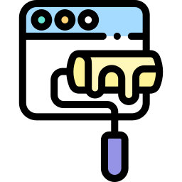
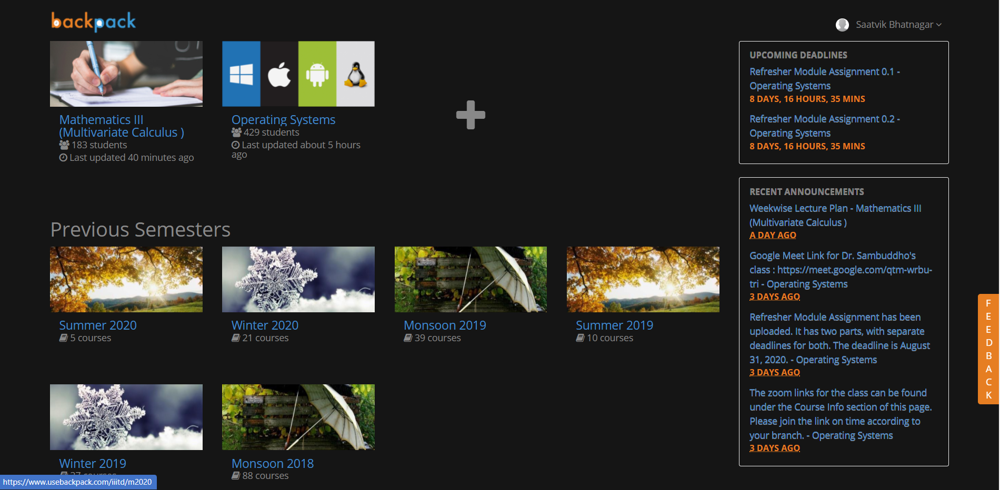
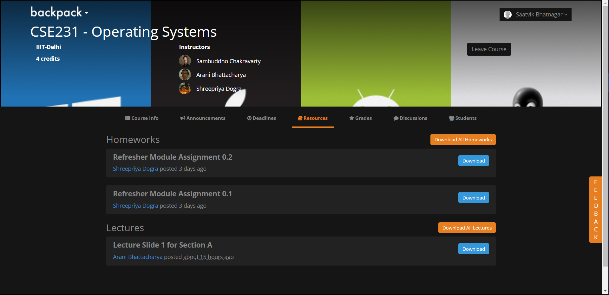

## BackpackDarkTheme

### A google chrome and firefox extension for Backpack.

### Uses CSS to enhance UX by introducing dark mode.

<!-- 
 -->

## How to use (Google Chrome)?

1. Clone the repository/ Download all the files in a single folder
2. Go to chrome://extensions/
3. Enable developer mode, click on load unpacked and choose the folder in which you downloaded all the files
4. The extension would now work on www.usebackpack.com

<b>The extension would soon be available on Chrome Web Store</b>

## How to use (Mozilla Firefox)?

1. Clone the repository/ Download all the files in a single folder
2. Go to about:debugging
3. Click "This Firefox"(in newer versions of Firefox) click "Load Temporary Add-On"
4. Choose the folder in which you downloaded all the files and click on manifest.json
5. The extension would now work on www.usebackpack.com

Logo made by <a href="https://www.flaticon.com/authors/freepik" title="Freepik">Freepik</a> from <a href="https://www.flaticon.com/" title="Flaticon"> www.flaticon.com</a>
